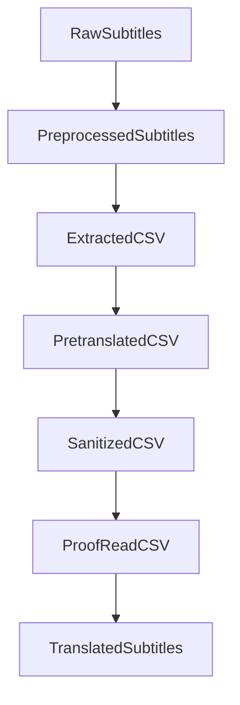

# DoubleFineAdventureZHTranslationProject

This project aims to create Traditional Chinese (Taiwan) subtitles for the [*Double Fine Adventure!*](https://www.youtube.com/playlist?list=PLIhLvue17Sd7F6pU2ByRRb0igiI-WKk3D) series.

## Workflow Overview

### Steps Detailed

### RawSubtitles

*Double Fine Adventure!* already has English subtitles available. These subtitles are manually fetched from the existing source.

### PreprocessedSubtitles

To facilitate translation, the subtitles are cleaned using `srt_preprocess.py` with the following criteria:

- Merge multi-line subtitles into a single line.
- Combine two subtitles if the first does not end with punctuation.

Having single-line structural complete text in each spreadsheet cell makes the translation process easier.

### ExtractedCSV

The cleaned subtitles are formatted into a CSV file using `extract_csv.py`, enabling easy manipulation within a spreadsheet.

### PretranslatedCSV

Translating a 127,470-word subtitle manually would be overwhelming. Therefore, machine translation is employed using OpenAI's GPT-4 or GPT-o1-mini models to provide a solid foundation for proofreading.

### SanitizedCSV

Before human proofreading, the translated content is sanitized to minimize Simplified Chinese or China-specific terminology using `sanitize_content_zh.py`.

### ProofReadCSV

Human translators review and correct the sanitized CSV to ensure accuracy and quality of the final subtitles.

### TranslatedSubtitles

The proofread CSV files are converted back into SRT files using `convert_csv_to_srt.py`, resulting in the final Traditional Chinese (Taiwan) subtitles.